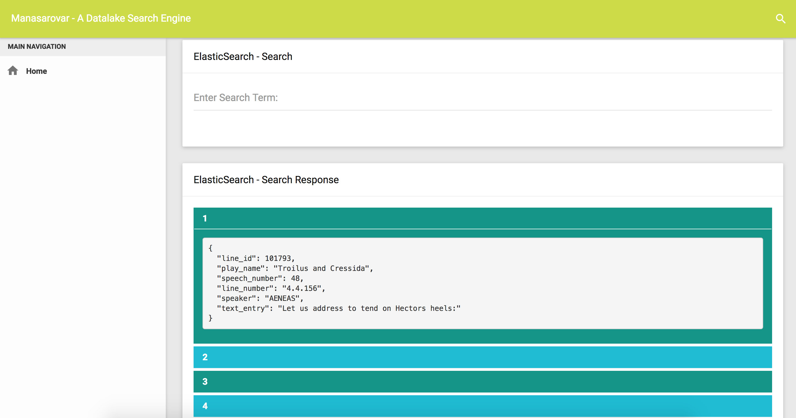

# manasarovar
A simple search engine for the Datalake

Every project needs a somewhat decent looking user interface. This is my first take on building a simple search engine for the Bigdata ecosystem. I an working on integrating Elasticsearch with Hive, HDFS and Spark. I also plan to integrate with Apache Atlas and build a comprehensive data catalog and data lineage capability

A big shouout to @gurayyarar for create a nice Material design based UI template https://github.com/gurayyarar/AdminBSBMaterialDesign. Please download the AdminBSBMaterialDesign repo from the aforementioned github repo and place it in plugins folder

