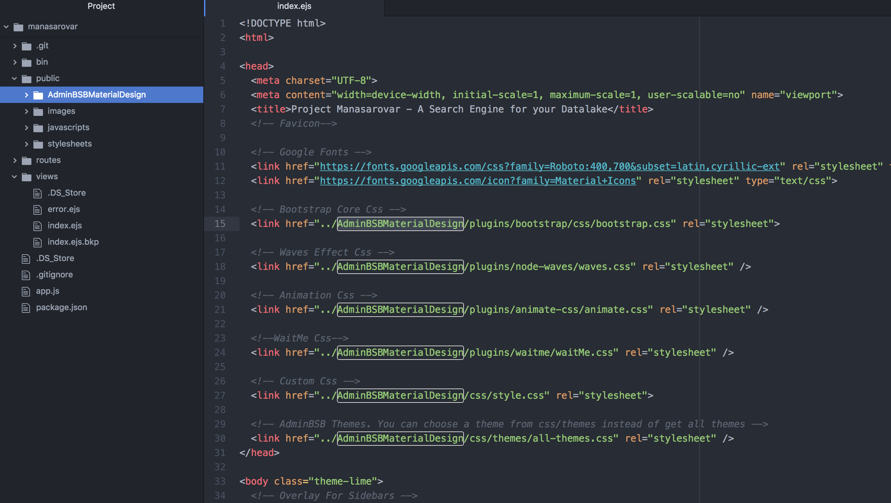

# manasarovar
A simple search engine for the Datalake

Requirements:
  Elasticsearch
  Node.js, npm

Make sure that Elasticsearch is up and running. Change the url accordingly in routes/index.js.

npm install
npm start

http://localhost:3000/

Every project needs a somewhat decent looking user interface. This is my first take on building a simple search engine for the Bigdata ecosystem. I am working on integrating Elasticsearch with Hive, HDFS and Spark. I also plan to integrate with Apache Atlas and build a comprehensive data catalog and data lineage capability.

A big shout-out to @gurayyarar for sharing a nice Material Design based UI template. https://github.com/gurayyarar/AdminBSBMaterialDesign. Please download the AdminBSBMaterialDesign repo from the aforementioned github repo and place it in plugins folder

